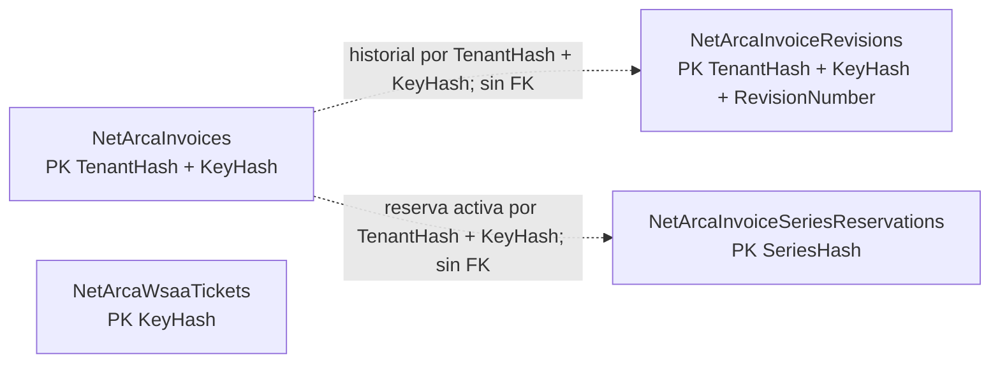

<!-- Source: docs/wiki/Modelo-relacional.md. Generated wiki mirror; edit the repository source. -->

# Modelo relacional de persistencia EF Core

Esta referencia describe el modelo **opcional** agregado por
`NetArcaWs.EntityFrameworkCore` y los scripts SQL generados desde ese modelo.
No representa una conversión automática del diario SQLite integrado en el
paquete principal. Los scripts son DDL inicial, no migraciones; la aplicación
consumidora es dueña de las migraciones, su revisión, aplicación y evolución.

## Selección de módulos

La selección inmutable de `NetArcaWsModelOptions` decide qué entidades entran
en el modelo EF. La selección de servicios no agrega tablas: habilita los
servicios admitidos para las filas del diario o los tickets compartidos.

| Selección | Tablas incluidas |
| --- | --- |
| Sin módulos | 0 |
| `AddInvoicing(...)` | 3: `NetArcaInvoices`, `NetArcaInvoiceRevisions`, `NetArcaInvoiceSeriesReservations` |
| `AddWsaaTickets(...)` | 1: `NetArcaWsaaTickets` |
| Ambos módulos | 4 |

El diario admite WSFEv1, WSFEXv1 y WSMTXCA. Los tickets permiten cualquier
servicio autenticado admitido por `ArcaService`, salvo WSAA. La aplicación debe
usar la misma selección al configurar el modelo y registrar sus stores.

```csharp
NetArcaWsModelOptions model = NetArcaWsModelOptions.Configure(options =>
    options.AddInvoicing(ArcaService.Wsfev1, ArcaService.Wsfexv1)
        .AddWsaaTickets(ArcaService.Wsfev1));

modelBuilder.AddNetArcaWs(model);
```

## Diagrama lógico

Las líneas discontinuas muestran la relación que el código interpreta entre
hashes. El modelo EF actual define **cero claves foráneas**: estas líneas no
son restricciones físicas y no hay acciones `ON DELETE`, cascadas ni
restricciones `CHECK` para enums.



La tabla WSAA es independiente de las entidades fiscales. La identidad lógica
de un ticket se resume en `KeyHash`, derivado de certificado, endpoint y servicio. No incluye
tenant ni CUIT: la autorización del contexto corresponde a la aplicación y
no se almacena en esta identidad remota. Una rotación de certificado puede
crear otra identidad para ARCA y aún así colisionar con alias remotos.

## Claves e índices

| Tabla | Claves e índices del modelo |
| --- | --- |
| `NetArcaInvoices` | PK `(TenantHash, KeyHash)` para la clave idempotente dentro del tenant; único `FiscalHash` para `(ambiente, CUIT, punto de venta, tipo, número)` global a tenants, servicios y protocolos; único `RemoteHash` cuando existe un ID remoto; índice `(TenantHash, CreatedUtcTicks)` para listar por tenant/fecha. |
| `NetArcaInvoiceRevisions` | PK `(TenantHash, KeyHash, RevisionNumber)`; conserva las versiones previas rechazadas para auditoría. |
| `NetArcaInvoiceSeriesReservations` | PK `SeriesHash` para reservar `(ambiente, CUIT, punto de venta, tipo)` mientras el resultado no sea terminal; único `(TenantHash, KeyHash)` para vincular lógicamente una operación. |
| `NetArcaWsaaTickets` | PK `KeyHash`; índice `(State, UpdatedUtcTicks)` para localizar coordinación pendiente y tickets. |

Las identidades textuales se hashean con SHA-256 sobre valores codificados de
forma determinista; los hashes almacenados son hexadecimales de 64 caracteres.
`TenantHash` y `KeyHash` protegen comparaciones ordinales frente a collations,
pero los identificadores legibles originales también se conservan para validar
integridad y resolver colisiones. La clave idempotente no define la unicidad
fiscal global. `FiscalHash` excluye el tenant, el servicio y el protocolo para
que una CUIT no pueda duplicar la misma identidad fiscal bajo otra partición.

`RemoteHash` se calcula con ambiente, CUIT, servicio e ID remoto. El índice
único SQL Server generado es filtrado con `WHERE RemoteHash IS NOT NULL`;
SQLite, MySQL, MariaDB y PostgreSQL generan un índice único simple y sus motores
permiten múltiples valores NULL distintos. En todos los casos solo se reserva
un ID remoto presente.

## Diccionario: `NetArcaInvoices`

Todos los campos salvo `RemoteHash`, `RemoteRequestId`, `LeaseUntilMilliseconds`,
`AuthorizationCode` y `ResponseXml` son `NOT NULL`.

| Columna | Longitud EF | Significado |
| --- | ---: | --- |
| `TenantHash` | 64 | SHA-256 del identificador de tenant; parte de la PK. |
| `KeyHash` | 64 | SHA-256 de la clave idempotente; parte de la PK junto al tenant. |
| `TenantId` | 128 | Identificador de tenant original para comprobación de integridad/colisión. |
| `IdempotencyKey` | 128 | Clave idempotente original. |
| `Service` | 128 | Nombre de servicio fiscal seleccionado. |
| `ServiceHash` | 64 | Hash de servicio usado en las comprobaciones de integridad. |
| `Environment` | — | `ArcaEnvironment` como entero: `0` homologación, `1` producción. |
| `Cuit` | — | CUIT representada, `long`. |
| `PointOfSale` | — | Punto de venta, `int`. |
| `VoucherType` | — | Tipo de comprobante, `int`. |
| `VoucherNumber` | — | Número de comprobante, `long`. |
| `FiscalHash` | 64 | Hash de identidad fiscal global. Índice único. |
| `RemoteHash` | 64 | Nullable; hash de identidad de solicitud remota cuando existe. Índice único. |
| `RemoteRequestId` | — | Nullable; ID de solicitud específico del servicio. |
| `Payload` | — | Snapshot fiscal congelado; no contiene Token/Sign WSAA. |
| `PayloadHash` | 64 | SHA-256 del payload congelado. |
| `CanonicalVersion` | — | Versión de codificación canónica del snapshot. |
| `State` | — | `InvoiceState` como entero: `0 Prepared`, `1 Submitting`, `2 Unknown`, `3 Reconciling`, `4 Authorized`, `5 Rejected`, `6 Conflict`, `7 ManualReview`. |
| `Version` | — | Versión de fencing del intento. |
| `Attempt` | — | Número de intento/claim registrado. |
| `LeaseUntilMilliseconds` | — | Nullable; instante de vencimiento de lease como Unix epoch en milisegundos UTC. |
| `AuthorizationCode` | — | Nullable; código de autorización devuelto por ARCA. |
| `ResponseXml` | — | Nullable; respuesta fiscal conservada para reconciliación/auditoría. |
| `CreatedUtcTicks` | — | `DateTimeOffset.UtcTicks`: ticks .NET de 100 ns desde 0001-01-01 UTC. |

## Diccionario: `NetArcaInvoiceRevisions`

Todos los campos salvo `RemoteRequestId`, `LeaseUntilMilliseconds`,
`AuthorizationCode` y `ResponseXml` son `NOT NULL`. Cada fila representa un
snapshot anterior de una revisión explícita de un rechazo.

| Columna | Longitud EF | Significado |
| --- | ---: | --- |
| `TenantHash` | 64 | Hash del tenant; primera parte de la PK compuesta. |
| `KeyHash` | 64 | Hash idempotente; segunda parte de la PK compuesta. |
| `RevisionNumber` | — | Número secuencial de revisión; tercera parte de la PK. |
| `TenantId`, `IdempotencyKey` | 128 cada una | Identificadores originales conservados en el snapshot. |
| `Service` | 128 | Servicio fiscal. |
| `Environment` | — | `ArcaEnvironment` entero: 0 homologación, 1 producción. |
| `Cuit` | — | CUIT representada, `long`. |
| `PointOfSale` | — | Punto de venta, `int`. |
| `VoucherType` | — | Tipo de comprobante, `int`. |
| `VoucherNumber` | — | Número, `long`. |
| `RemoteRequestId` | — | Nullable; ID remoto que se debe preservar entre revisión y envío. |
| `Payload` | — | Payload fiscal histórico. |
| `PayloadHash` | 64 | Hash SHA-256 del payload. |
| `SnapshotHash` | 64 | Hash de integridad del snapshot completo de revisión. |
| `CanonicalVersion` | — | Versión canónica del payload. |
| `State` | — | Estado histórico como entero de `InvoiceState`; el código valida estados permitidos. |
| `Version` | — | Versión de operación histórica. |
| `Attempt` | — | Intentos registrados en la versión histórica. |
| `LeaseUntilMilliseconds` | — | Nullable; lease de la operación, Unix epoch ms UTC. |
| `AuthorizationCode`, `ResponseXml` | — | Nullable; datos de respuesta guardados en el snapshot. |

## Diccionario: `NetArcaInvoiceSeriesReservations`

Las tres columnas son `NOT NULL`. Esta tabla no tiene FK física a la factura.
La aplicación libera la reserva mediante las transiciones terminales del diario.

| Columna | Longitud EF | Significado |
| --- | ---: | --- |
| `SeriesHash` | 64 | SHA-256 de ambiente, CUIT, punto de venta y tipo; clave primaria global. |
| `TenantHash` | 64 | Hash del tenant que abrió la operación. |
| `KeyHash` | 64 | Hash idempotente que identifica lógicamente la factura en ese tenant. |

## Diccionario: `NetArcaWsaaTickets`

Todos los campos salvo `OwnerId`, `LeaseUntilUtcTicks`, `ExpiresUtcTicks`,
`KeyId`, `Nonce`, `Ciphertext` y `Tag` son `NOT NULL`.

| Columna | Longitud EF | Significado |
| --- | ---: | --- |
| `KeyHash` | 64 | SHA-256 de certificado SHA-256, endpoint y servicio; PK y clave lógica remota. |
| `CertificateHash` | 64 | Huella SHA-256 del certificado. |
| `Endpoint` | 512 | Endpoint oficial elegido por ambiente. |
| `Service` | 32 | Nombre de servicio solicitado a WSAA. |
| `State` | — | Estado entero interno: `1 Pending`, `2 Unknown`, `3 Ticket`; no hay `CHECK` SQL. |
| `OwnerId` | 36 | Nullable; identificador de propietario del claim activo. |
| `Fence` | — | Token creciente de fencing para impedir que propietarios antiguos sobrescriban claims nuevos. |
| `Version` | — | Versión creciente para compare-and-swap del registro. |
| `LeaseUntilUtcTicks` | — | Nullable; vencimiento de claim en ticks .NET UTC (100 ns). |
| `ExpiresUtcTicks` | — | Nullable; vencimiento TA real reportado por WSAA en ticks .NET UTC (100 ns). |
| `KeyId` | 128 | Nullable; ID para resolver la clave externa del protector. |
| `Nonce`, `Ciphertext`, `Tag` | — | Nullable; componentes AES-GCM del ticket cifrado. El protector valida nonce de 12 bytes y tag de 16 bytes; el texto cifrado conserva el XML serializado. |
| `UpdatedUtcTicks` | — | Instante de actualización en ticks .NET UTC (100 ns). |

El keyring no se guarda en la base de datos. La aplicación registra el
`IWsaaTicketProtector`, distribuye de forma segura las mismas claves entre
réplicas y conserva las claves antiguas mientras existan filas cifradas con su
`KeyId`. Token y Sign están dentro del ciphertext; el endpoint, servicio,
huella de certificado, nonce y tag quedan visibles como metadatos.

## Tipos, límites y restricciones

Los scripts concretan los tipos de cada proveedor. EF configura `HasMaxLength`
para los identificadores y hashes mostrados arriba. SQL Server, MySQL, MariaDB
y PostgreSQL traducen esos límites a tipos `nvarchar(n)`, `varchar(n)` o
`character varying(n)`. SQLite los emite como `TEXT`, que no impone el máximo de
caracteres. La biblioteca valida identificadores y el tamaño de payload fiscal;
`HasMaxLength` no equivale a una validación uniforme en la base.

La biblioteca también valida estados y el tamaño de clave/nonce/tag del ticket.
El modelo no crea `CHECK` constraints para estados, hash-length, nonce/tag, ni
FK o cascadas. Las columnas payload/XML y autorización no tienen `HasMaxLength`.
`RemoteHash` es nullable; el DDL de SQL Server usa índice filtrado y los otros
motores permiten múltiples NULL distintos en el índice único simple.

Todos los esquemas son aditivos desde la perspectiva del consumidor: aplicar
una selección distinta o actualizar el paquete no migra ni elimina tablas. La
aplicación debe escribir y revisar una migración propia antes de desplegar el
cambio de modelo; no use `EnsureCreated` en producción. El almacenamiento de
certificados y una cola/worker no forman parte de este modelo.

## Scripts generados

`dotnet run --project tools/NetArcaWs.Build -- persistence-schema` genera los
scripts desde los modelos EF; `--check` detecta archivos ausentes, distintos o
sobrantes sin reescribirlos. CI ejecuta el modo de comprobación.

| Proveedor | Facturación | Tickets WSAA | Ambos |
| --- | --- | --- | --- |
| SQLite | [invoicing](https://github.com/ARSASWebDesign/NetArcaWs/blob/main/docs/reference/persistence/sqlite/invoicing.sql) | [wsaa-tickets](https://github.com/ARSASWebDesign/NetArcaWs/blob/main/docs/reference/persistence/sqlite/wsaa-tickets.sql) | [all](https://github.com/ARSASWebDesign/NetArcaWs/blob/main/docs/reference/persistence/sqlite/all.sql) |
| MySQL | [invoicing](https://github.com/ARSASWebDesign/NetArcaWs/blob/main/docs/reference/persistence/mysql/invoicing.sql) | [wsaa-tickets](https://github.com/ARSASWebDesign/NetArcaWs/blob/main/docs/reference/persistence/mysql/wsaa-tickets.sql) | [all](https://github.com/ARSASWebDesign/NetArcaWs/blob/main/docs/reference/persistence/mysql/all.sql) |
| MariaDB | [invoicing](https://github.com/ARSASWebDesign/NetArcaWs/blob/main/docs/reference/persistence/mariadb/invoicing.sql) | [wsaa-tickets](https://github.com/ARSASWebDesign/NetArcaWs/blob/main/docs/reference/persistence/mariadb/wsaa-tickets.sql) | [all](https://github.com/ARSASWebDesign/NetArcaWs/blob/main/docs/reference/persistence/mariadb/all.sql) |
| PostgreSQL | [invoicing](https://github.com/ARSASWebDesign/NetArcaWs/blob/main/docs/reference/persistence/postgresql/invoicing.sql) | [wsaa-tickets](https://github.com/ARSASWebDesign/NetArcaWs/blob/main/docs/reference/persistence/postgresql/wsaa-tickets.sql) | [all](https://github.com/ARSASWebDesign/NetArcaWs/blob/main/docs/reference/persistence/postgresql/all.sql) |
| SQL Server | [invoicing](https://github.com/ARSASWebDesign/NetArcaWs/blob/main/docs/reference/persistence/sqlserver/invoicing.sql) | [wsaa-tickets](https://github.com/ARSASWebDesign/NetArcaWs/blob/main/docs/reference/persistence/sqlserver/wsaa-tickets.sql) | [all](https://github.com/ARSASWebDesign/NetArcaWs/blob/main/docs/reference/persistence/sqlserver/all.sql) |
